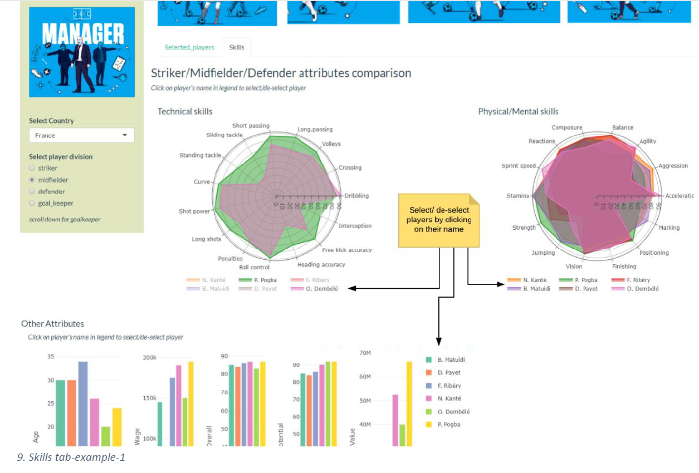

# FIFA
FIFA WorldCup visualization using  R, Rshiny. 

### 1) Introduction           
Soccer Mania is a one stop destination to view the 1930 -2018 FIFA Worldcup story. This project displays the matches, teams and players' statistics. The whole project is implemented in Rshiny.
And the intended audiences are:        
• FIFA fan: A FIFA enthusiastic can view how many goals/ wins each country scored.               
• Team Manager: Soccer mania assists managers to view how each player vary with skills under each player division (striker, midfielder, defender and goalkeeper). For example, manager can view top 6 strikers and soccer mania assist to decide whom to select among 6 strikers.

-------------------------
#### The URL link can be found below.             
[FIFA_shinyapp](https://vpatil.shinyapps.io/soccer_mania/)

-------------------------         

### 2) Tab-1: Landing page

-------------------------

### 3) Tab-2: FIFA visualization tab

-------------------------

### 4) Tab-3: Team Manager tab

